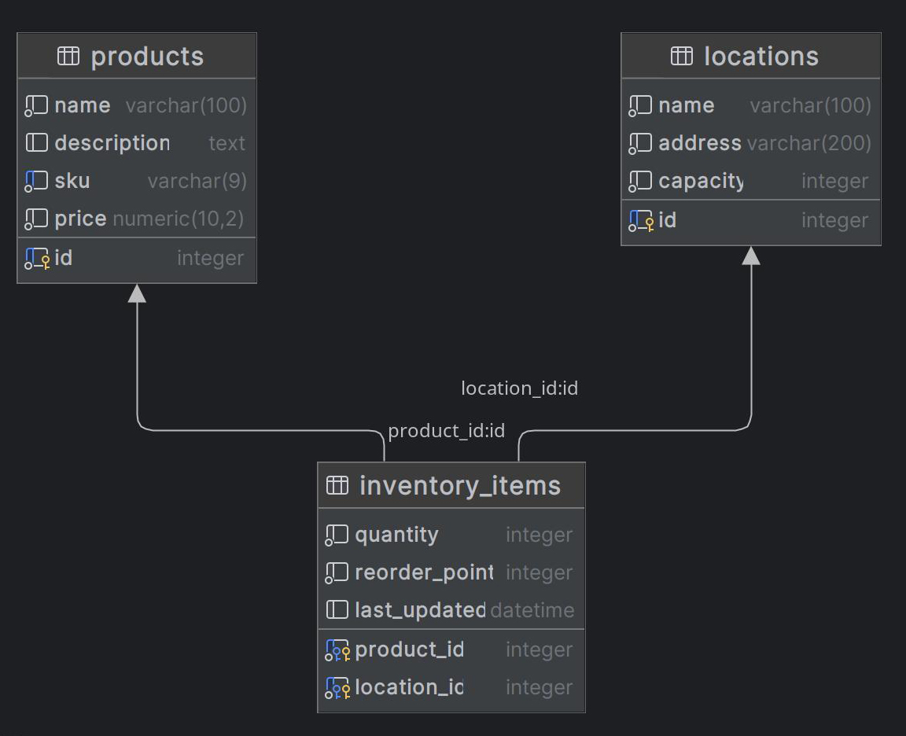

# 🛒 estore_api     

## Overview

**estore_api** is a training project created as part of an intensive one-year Data Science course. Its primary goal is to build a backend API for an e-commerce store using modern technologies such as **FastAPI**, **SQLAlchemy**, **Docker**, and both **PostgreSQL** and **MongoDB** for data storage.

The project is developed to solidify backend development skills and to simulate real-world scenarios, following clean architecture and modular design patterns.

## Entity Relationship Diagram

The diagram below illustrates the core database structure of the project. It consists of three main entities:

- **products**: stores product information such as name, SKU, and price.
- **locations**: represents physical storage locations with defined capacities.
- **inventory_items**: a linking table tracking product quantities and restock levels at specific locations.

This relational design ensures scalable inventory management across multiple storage sites.




## Features

- 📦 **Product** and **Inventory** management
- 🗺️ **Locations** with capacity handling
- 📊 SQLite used for early development; PostgreSQL and MongoDB planned
- 🔌 Modular code structure following best practices
- 🧪 Ready for unit testing and API documentation via Swagger UI

## Technologies Used

- **Python 3.11+**
- **FastAPI** - lightweight API framework
- **SQLAlchemy** - ORM for SQL databases
- **SQLite / PostgreSQL** - relational database engines
- **MongoDB** - planned integration for document storage
- **Docker** - containerization for reproducible environments
- **uvicorn** - ASGI server
- **Pydantic** - data validation and serialization

## Project Structure

```

estore_api/
├── .venv/                        # Virtual environment (not tracked in Git)
├── app/
│   ├── core/                     # Core configurations (settings, constants, utils)
│   ├── crud/                     # CRUD repositories (SQLAlchemy-based database operations)
│   │   ├── __init__.py
│   │   ├── inventory.py          # Inventory-related DB operations
│   │   ├── location.py           # Location-related DB operations
│   │   └── product.py            # Product-related DB operations
│   ├── db/
│   │   ├── models/               # SQLAlchemy ORM models for all entities
│   │   │   ├── __init__.py
│   │   │   ├── inventory.py      # InventoryItem model
│   │   │   ├── location.py       # Location model
│   │   │   └── product.py        # Product model
│   │   ├── __init__.py
│   │   └── session.py            # Database engine and session configuration
│   ├── routers/                  # FastAPI route declarations (API endpoints)
│   │   ├── __init__.py           # Router registration (imports all subrouters)
│   │   └── products.py           # Routes for managing product endpoints
│   ├── schemas/                  # Pydantic schemas for request and response validation
│   │   ├── __init__.py
│   │   └── main.py               # Schemas for products, locations, etc.
│   ├── assets/                   # Assets for documentation (ERD, images, diagrams)
│   │   └── img/
│   │       ├── estore_db_ER_diagram.jpg
│   │       ├── estore_ERD.gif
│   │       ├── estore_ERD.jpg
│   │       └── estore_ERD.png
│   ├── fixtures/                 # Sample data for testing or development
│   │   ├── __init__.py
│   │   └── sample_data.json
│   ├── management/               # Administrative tools (e.g. DB setup utilities)
│   │   ├── __init__.py
│   │   ├── config.py             # App config loader
│   │   └── database_utils.py     # Functions for initializing or seeding the database
│   └── main.py                   # FastAPI entry point (app instance and startup logic)
├── .gitignore                    # Git ignore rules
├── .python-version               # Python version used in project
├── inventory.db                  # Local SQLite database for development
├── pyproject.toml                # Project metadata and dependencies (Poetry)
├── README.md                     # Project documentation
└── uv.lock                       # Dependency lock file (uv)
````

## Installation

```bash
# Clone the repository
git clone git@github.com:Kinetics20/estore_api.git
cd estore_api

# Sync dependencies (if you have 'uv' installed)
uv sync
````

## Usage

```bash
# Run the API using uvicorn
uvicorn app.main:app --reload
```

Visit the interactive API docs at [http://localhost:8000/docs](http://localhost:8000/docs)


### 📦 Database Initialization & Sample Data

After cloning the project and installing dependencies, you can set up the database and load sample data using the management script.

#### 🔧 Initialize the database schema

This command creates the database tables defined in the models:

```bash
python management/database_utils.py --init-db
```

#### 📥 Load sample data (optional)

To pre-populate the database with test data (e.g. products, locations, inventory):

```bash
python management/database_utils.py --load-sample-data
```

The data source is located at:

```
app/fixtures/sample_data.json
```


## Notes

* Current development uses **SQLite** (`inventory.db`) for rapid testing.
* PostgreSQL and MongoDB support will be added in upcoming phases.
* Docker integration planned for production environment and testing pipelines.

---

> This is a learning and training project for educational purposes.

## 💬 Feedback

Contributions and suggestions are welcome!

👤 **Author**: Piotr Lipiński
🗓 **Date**: June 2025
